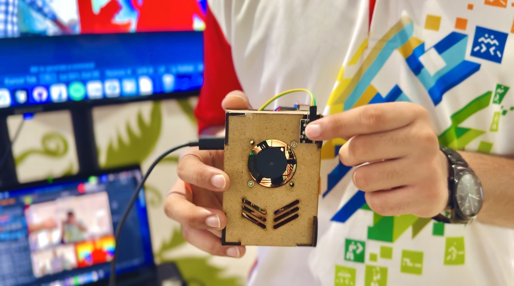
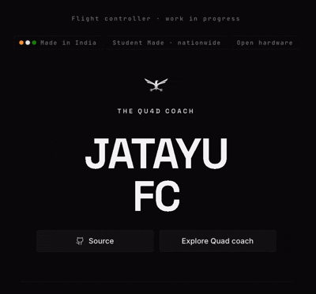

  

---
## Notable Electronics Projects

<table width="100%" cellspacing="0" cellpadding="8">
<tr>
<td colspan="3" style="border:1px solid #888;"><b>• Horn-Bill</b></td>
</tr>

<tr>
<td width="33.33%" style="border:1px solid #888;">

</td>

<td width="33.33%" style="border:1px solid #888;">

</td>

<td width="33.33%" style="border:1px solid #888;">

</td>
</tr>

<tr>
<td style="border:1px solid #888;">
<a href="https://github.com/BENi-Aditya/Drone_Brain"><b>Horn-Bill</b></a>
</td>

<td style="border:1px solid #888;">
Horn-Bill is an autonomous drone system designed for reforestation. It identifies barren patches of land and precisely deploys eco-friendly seed bombs to accelerate large-scale afforestation.
</td>

<td style="border:1px solid #888;">
<a href="https://www.youtube.com/watch?v=Dli05LBOTP0">YouTube Demo</a>
</td>
</tr>
</table>

---
<table width="100%" cellspacing="0" cellpadding="8">
<tr>
<td colspan="3" style="border:1px solid #888;"><b>• Blind Sight</b></td>
</tr>

<tr>
<td width="33.33%" style="border:1px solid #888;">

</td>

<td width="33.33%" style="border:1px solid #888;">

</td>

<td width="33.33%" style="border:1px solid #888;">

</td>
</tr>

<tr>
<td style="border:1px solid #888;">
<a href="https://github.com/BENi-Aditya/Blind-Accesibility-Device"><b>Blind Sight</b></a>
</td>

<td style="border:1px solid #888;">
A Raspberry Pi-powered wearable that provides real-time audio feedback for obstacle detection and navigation assistance.
</td>

<td style="border:1px solid #888;">
<a href="https://youtu.be/8FhNYJAvp90?si=TlzIMzzUjoemsxwi">YouTube Demo</a>
</td>
</tr>
</table>

---

<table width="100%" cellspacing="0" cellpadding="8">

<tr>

<td width="33.33%" style="border:1px solid #888;">

</td>

<td width="33.33%" style="border:1px solid #888;">

</td>

<td width="33.33%" style="border:1px solid #888;">

</td>

</tr>

<tr>

<td style="border:1px solid #888;">
<a href="https://github.com/BENi-Aditya/Arduino_RC_Car"><b>RC Car</b></a>
</td>

<td style="border:1px solid #888;">
<a href="https://github.com/BENi-Aditya/WhyBit-rebuild"><b>Whybit Rebuild</b></a>
</td>

<td style="border:1px solid #888;">
<a href="https://github.com/BENi-Aditya/Waste-Segregation-with-Roboflow-and-Arduino"><b>Sea-UP</b></a>
</td>

</tr>

<tr>

<td style="border:1px solid #888;">
A Bluetooth-controlled Arduino RC car equipped with ultrasonic obstacle detection and automatic collision avoidance for smoother autonomous navigation.
</td>

<td style="border:1px solid #888;">
An open-source ESP32-C3 powered 3D-printed rebuild of the WhyBit rover, designed as a modular robotics platform for experimentation and learning.
</td>

<td style="border:1px solid #888;">
A smart waste segregation system that combines Roboflow computer vision with Arduino automation to identify and sort recyclable plastic waste.
</td>

</tr>

</table>

---

## Startup Projects

<table width="100%" cellspacing="0" cellpadding="8">

<tr>

<td width="50%" style="border:1px solid #888;">
<b><a href="https://openbuilder.in">• Open Builder</a></b>
</td>

<td width="50%" style="border:1px solid #888;">
<b><a href="https://thequadcoach.xyz">• Jatayu</a></b>
</td>

</tr>

<tr>

<td style="border:1px solid #888;">

</td>

<td style="border:1px solid #888;">

</td>

</tr>

<tr>

<td style="border:1px solid #888;">
<b>Instagram for Nerds</b>  

A social platform where builders showcase projects, discover ideas, and connect with collaborators to build together.
</td>

<td style="border:1px solid #888;">
An open-source flight controller PCB designed and built in India. Developed by students, Jatayu is a work-in-progress hardware platform focused on making advanced drone technology more accessible.
</td>

</tr>

<tr>

<td style="border:1px solid #888;">
<a href="https://openbuilder.in">openbuilder.in</a>
</td>

<td style="border:1px solid #888;">
<a href="https://thequadcoach.xyz">thequadcoach.xyz</a>
</td>

</tr>

</table>

---

## Software Projects

<table width="100%" cellspacing="0" cellpadding="8">

<tr>

<td width="33.33%" style="border:1px solid #888;">

</td>

<td width="33.33%" style="border:1px solid #888;">

</td>

<td width="33.33%" style="border:1px solid #888;">

</td>

</tr>

<tr>

<td style="border:1px solid #888;">
<a href="https://github.com/BENi-Aditya/VibeCode-MVP"><b>VibeCode</b></a>  
<a href="https://vibecode.openbuilder.in">Website</a> 
<a href="https://www.youtube.com/watch?v=qky4DxjHTt4&t=8s">YouTube Demo</a>
</td>

<td style="border:1px solid #888;">
<a href="https://github.com/BENi-Aditya/VitalScans.AI"><b>VitalScans</b></a>  
<a href="https://vitalscan.onrender.com/">Website</a> 
<a href="https://www.youtube.com/watch?v=_AQBNQMcyCo">YouTube Demo</a>
</td>

<td style="border:1px solid #888;">
<a href="https://github.com/BENi-Aditya/WatchAlong"><b>Watch Along</b></a>
</td>

</tr>

<tr>

<td style="border:1px solid #888;">
An AI-native cloud IDE with dedicated workspaces for ideation, environment setup, coding, debugging, and testing-all in one seamless workflow.
</td>

<td style="border:1px solid #888;">
An AI-powered medical imaging system that detects pneumonia, tuberculosis, and bone fractures using OpenCV, Roboflow models, and instance segmentation, achieving up to 94% accuracy.
</td>

<td style="border:1px solid #888;">
A real-time watch party platform where friends can watch YouTube together with synchronized playback, live chat, video calling, and shared media controls.
</td>

</tr>

</table>

