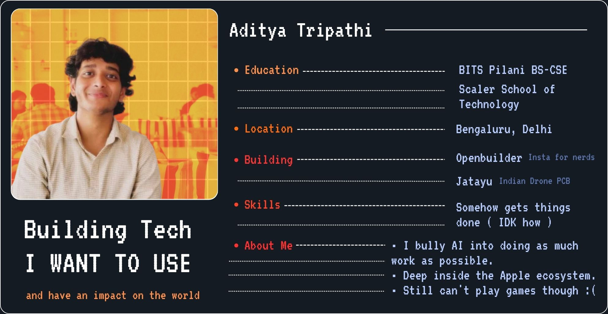
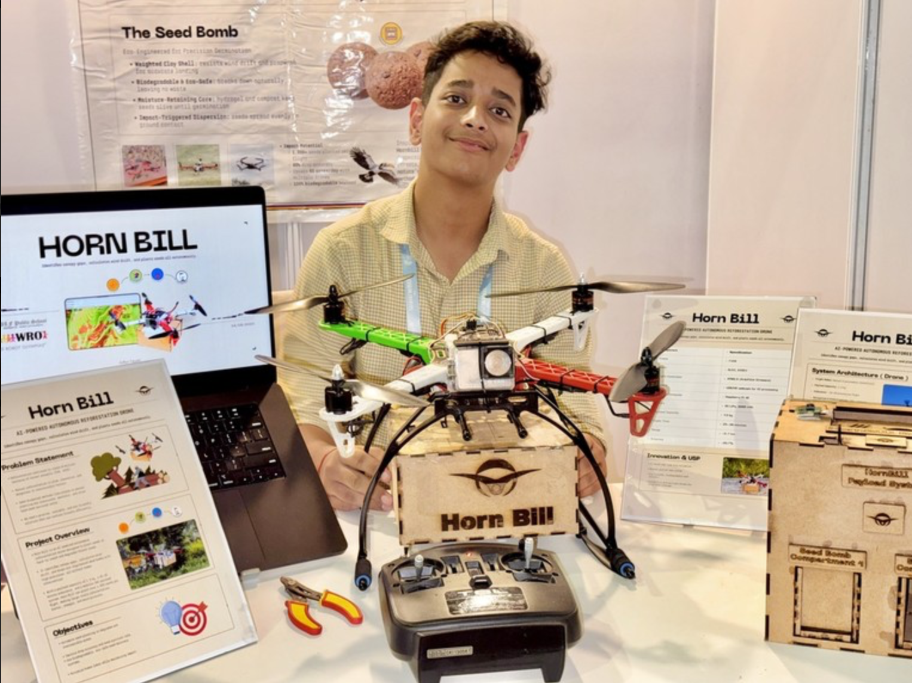
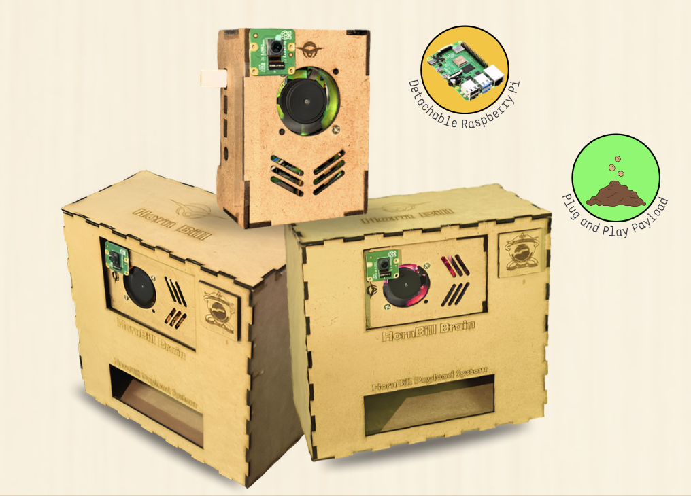
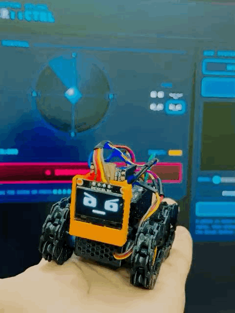

  

---
##THIS PAGE IS STILL UNDEER PROGRESS 9/7/2026
## Notable Electronics Projects

<table width="100%" cellspacing="0" cellpadding="8">
<tr>
<td colspan="3" style="border:1px solid #888;"><b>• Horn-Bill</b></td>
</tr>

<tr>
<td width="33.33%" style="border:1px solid #888;">

</td>

<td width="33.33%" style="border:1px solid #888;">

</td>

<td width="33.33%" style="border:1px solid #888;">

</td>
</tr>

<tr>
<td style="border:1px solid #888;">
<a href="https://github.com/BENi-Aditya/Drone_Brain"><b>Horn-Bill</b></a>
</td>

<td style="border:1px solid #888;">
Horn-Bill is an autonomous drone system designed for reforestation. It identifies barren land and precisely deploys eco-friendly seed bombs to accelerate large-scale afforestation.
</td>

<td style="border:1px solid #888;">
<a href="https://www.youtube.com/watch?v=Dli05LBOTP0">YouTube Demo</a>
</td>
</tr>
</table>

---

<table width="100%" cellspacing="0" cellpadding="8">

<tr>

<td width="33.33%" style="border:1px solid #888;">

</td>

<td width="33.33%" style="border:1px solid #888;">

</td>

<td width="33.33%" style="border:1px solid #888;">
Image Coming Soon
</td>

</tr>

<tr>

<td style="border:1px solid #888;">
<a href="https://github.com/BENi-Aditya/Arduino_RC_Car"><b>RC Car</b></a>
</td>

<td style="border:1px solid #888;">
<b>Whybit Rebuild</b>
</td>

<td style="border:1px solid #888;">
<a href="https://github.com/BENi-Aditya/Waste-Segregation-with-Roboflow-and-Arduino"><b>Sea-UP</b></a>
</td>

</tr>

<tr>

<td style="border:1px solid #888;">
A Bluetooth-controlled Arduino RC car equipped with ultrasonic obstacle detection and automatic collision avoidance for smoother autonomous navigation.
</td>

<td style="border:1px solid #888;">
An open-source ESP32-C3 powered 3D-printed rover rebuilt from the ground up as a modular robotics platform for experimentation and learning.
</td>

<td style="border:1px solid #888;">
A smart waste segregation system that combines Roboflow computer vision with Arduino automation to identify and sort recyclable plastic waste.
</td>

</tr>

</table>

---

## Startup Projects

<table width="100%" cellspacing="0" cellpadding="8">

<tr>

<td width="50%" style="border:1px solid #888;">
<b><a href="https://openbuilder.in">• Open Builder</a></b>
</td>

<td width="50%" style="border:1px solid #888;">
<b><a href="https://thequadcoach.xyz">• Jatayu</a></b>
</td>

</tr>

<tr>

<td style="border:1px solid #888;">
Image Coming Soon
</td>

<td style="border:1px solid #888;">
Image Coming Soon
</td>

</tr>

<tr>

<td style="border:1px solid #888;">
<b>Instagram for Nerds</b>  

A social platform where builders showcase projects, discover ideas, and connect with collaborators to build together.
</td>

<td style="border:1px solid #888;">
An open-source flight controller PCB designed and developed in India. Built by students, Jatayu is a work-in-progress hardware platform focused on advancing accessible drone technology.
</td>

</tr>

<tr>

<td style="border:1px solid #888;">
<a href="https://openbuilder.in">openbuilder.in</a>
</td>

<td style="border:1px solid #888;">
<a href="https://thequadcoach.xyz">thequadcoach.xyz</a>
</td>

</tr>

</table>

---

## Software Projects

<table width="100%" cellspacing="0" cellpadding="8">

<tr>

<td width="33.33%" style="border:1px solid #888;">

</td>

<td width="33.33%" style="border:1px solid #888;">

</td>

<td width="33.33%" style="border:1px solid #888;">

</td>

</tr>

<tr>

<td style="border:1px solid #888;">
Project 1
</td>

<td style="border:1px solid #888;">
Project 2
</td>

<td style="border:1px solid #888;">
Project 3
</td>

</tr>

<tr>

<td style="border:1px solid #888;">
Coming Soon
</td>

<td style="border:1px solid #888;">
Coming Soon
</td>

<td style="border:1px solid #888;">
Coming Soon
</td>

</tr>

</table>
